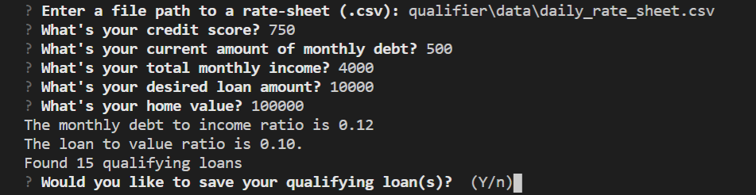

# BizOps Loan Qualifer Applicaiton

A command line python application designed for the company BizOps.

This application allows for users to determine what loans they qualify for on the basis of a few simple questions.

The end result is a CSV file providing up to 25 different loans, depending on the answers submitted.

---

## Technologies

This application runs on python version 3.7, with the following add-ons:

* [fire](https://github.com/google/python-fire) - For the command line interface, help page, and entrypoint.

* [pytest](https://docs.pytest.org/en/stable/) - For basic assertion testing of financial calculators and filters, and filio.

* [questionary](https://github.com/tmbo/questionary) - For interactive user prompts and dialogs

---

## Installation Guide

Before using the loan qualifier application, the following packages must be installed:

*    pip install fire
*    pip install pytest
*    pip install questionary

---

## Examples

This section should include screenshots, code blocks, or animations showing how your project works.

---

## Usage

To use the BizOps Loan Qualifer Application, clone the GitHub repository to your intended computer directory and run **app.py** with:

'''python
python app.py
'''

When using the BizOps Loan Qualifer Application, you will encounter the following series of questions.

---

## Contributors

Santiago Rosas

---

## License

MIT
